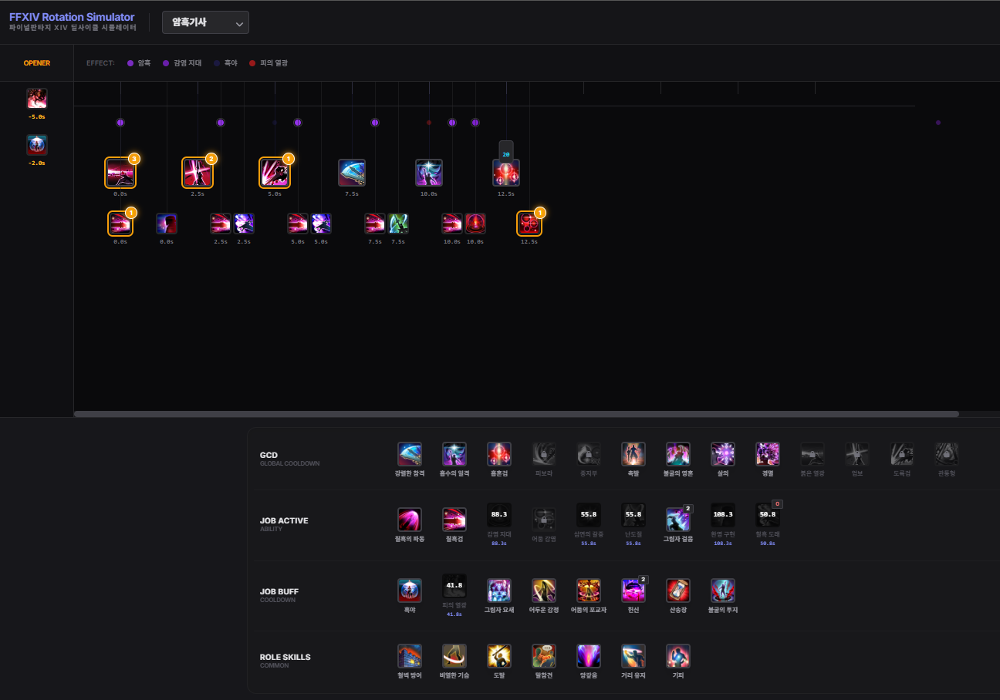
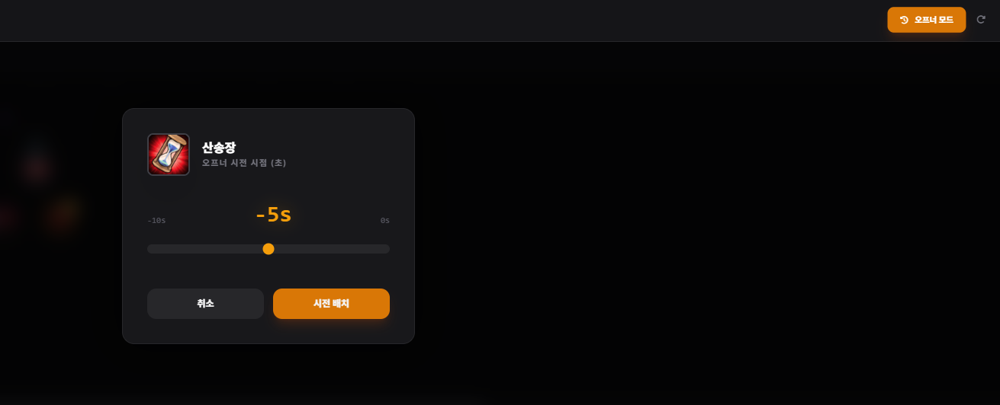

<div align="center">

</div>

# FFXIV Rotation Simulator
> 국문 명칭: 파이널판타지 XIV 딜사이클 시뮬레이터

이 리포지토리는 파이널판타지 XIV의 모든 전투 직업의 딜사이클을 시뮬레이션 할 수 있는 웹사이트의 소스코드를 가지고 있습니다.  
이 사이트의 모든 이미지 데이터는 주식회사 스퀘어 에닉스(SQUARE ENIX | スクウェアエニックス | Square Enix Co., Ltd.)의 소유이며, 웹사이트의 소스코드 저작권은 제작자(github id: justin212553)에게 있음을 밝힙니다.

## 버전 정보
```
마지막 업데이트: PST 2026. 02. 20  
업데이트 시점 FFXIV 버전: 7.4 (한국서버)
```

### 현재 완성된 직업:
방어 역할
- [ ] 나이트   
- [ ] 전사   
- [x] 암흑기사
- [ ] 건브레이커

근거리 공격 역할
- [ ] 몽크
- [x] 용기사
- [ ] 닌자
- [ ] 사무라이
- [ ] 리퍼
- [ ] 바이퍼

원거리 물리 공격 역할
- [ ] 음유시인
- [ ] 기공사
- [ ] 무도가

원거리 마법 공격 역할
- [ ] 흑마도사
- [ ] 소환사
- [ ] 적마도사
- [ ] 픽토맨서

회복 역할
- [ ] 백마도사
- [ ] 학자
- [ ] 점성술사
- [ ] 현자

## 사용 방법
<div align="center">

</div>

아래에서 순서대로 글쿨기, 논글쿨 액티브, 논글쿨 버프, 역할 스킬입니다.  
해당 스킬을 클릭할 시 글쿨기는 상단에, 논글쿨기는 하단에 뜨는 방식입니다.  

1 글쿨 사이클은 2.5초로 고정되어 있으며, 1 글쿨 당 넣을 수 있는 논글쿨 스킬은 2개로 고정되어 있습니다. (*그 이상의 논글쿨 스킬을 우겨넣는 것은 시스템 상 한계라고 판단하였습니다.)

예시로 보인 암흑기사의 '피의 열광'처럼 다른 스킬을 사용 가능하게 만들거나, '흑야' 처럼 프록을 부여하는 스킬의 경우 노란 테두리로 남은 프록 횟수와 함께 프록 표시가 나타납니다. 

또한, 암흑기사의 '흡혼검' 처럼 게이지를 채우는 스킬의 경우 아이콘 위에 얼마만큼의 자원이 쌓였는지 시뮬레이션 할 수 있습니다. 현자나 리퍼처럼 자원 게이지가 2개 이상인 경우는 현재 준비 중입니다. (진짜 어떡하지)

암흑기사의 '흑혈' 처럼 버프를 부여하는 스킬은 타임라인 상단에 버프명과 함께 점으로 버프의 지속시간이 표시됩니다. 

<div align="center">

</div>

우측 상단의 '오프너 모드' 버튼을 누르면 전투 시작 -10초 ~ -0초 이내에 미리 시전해 둘 스킬을 선택할 수 있습니다. 

슬라이더를 좌우로 움직여 정수 단위의 시간을 설정할 수 있으며, 오프너로 선택된 스킬은 타임라인 좌측에 시전 순서대로 세로로 정렬되어 나타납니다.

## 제작자 정보
제작자: 웬디고@초코보 서버

<div align="center">

</div>

```
이 웹사이트의 일부 기능은 Google AI Studio를 이용하여 만들어졌음을 밝힙니다.
```
